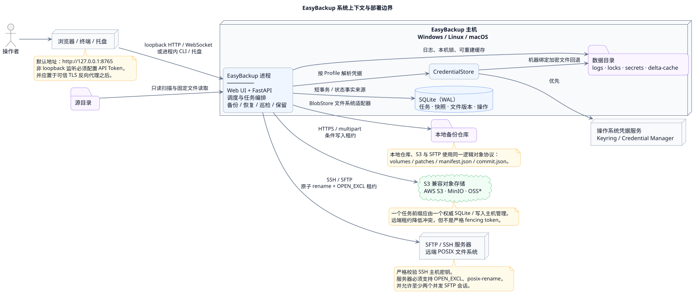
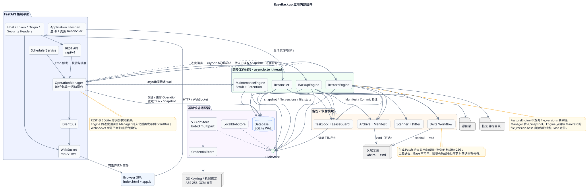
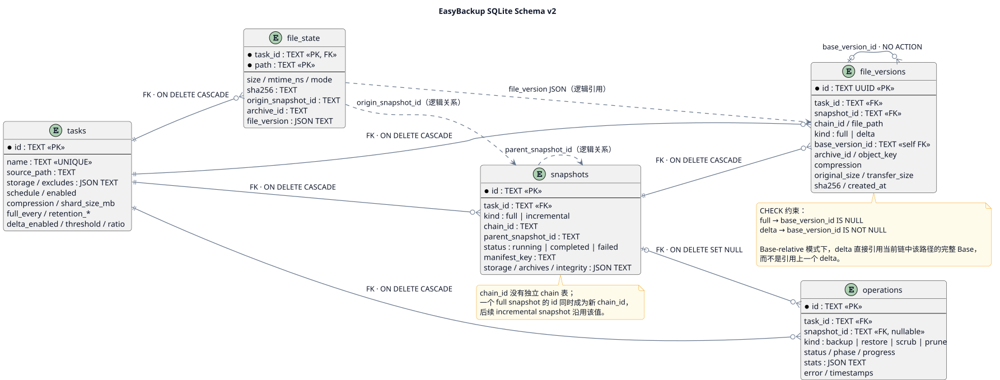
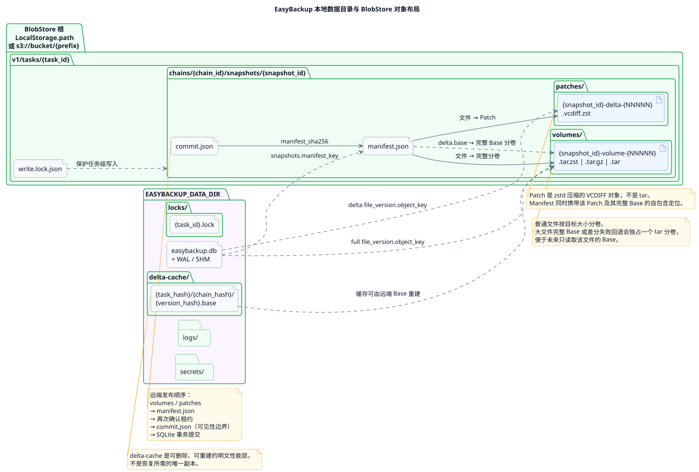
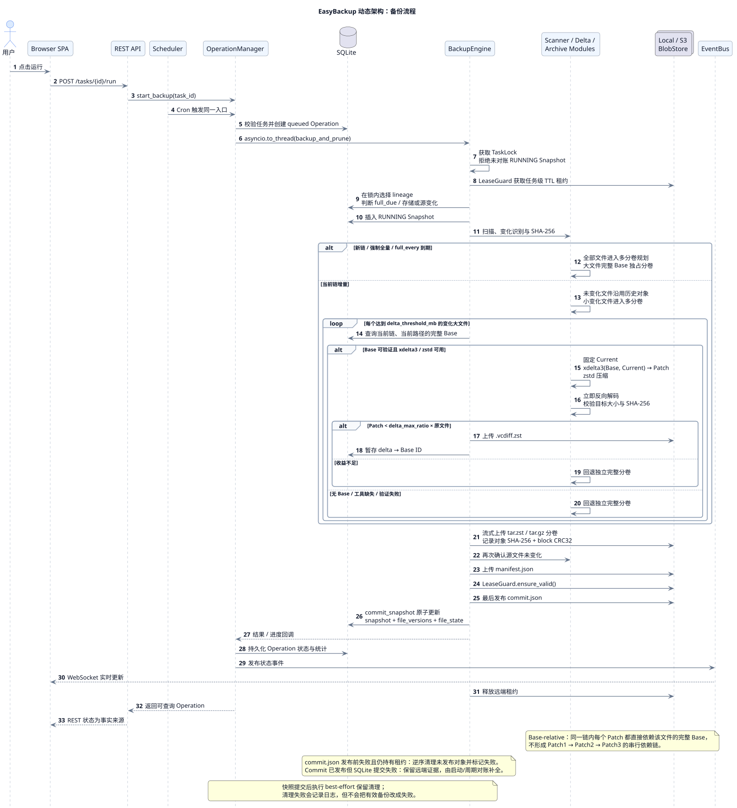
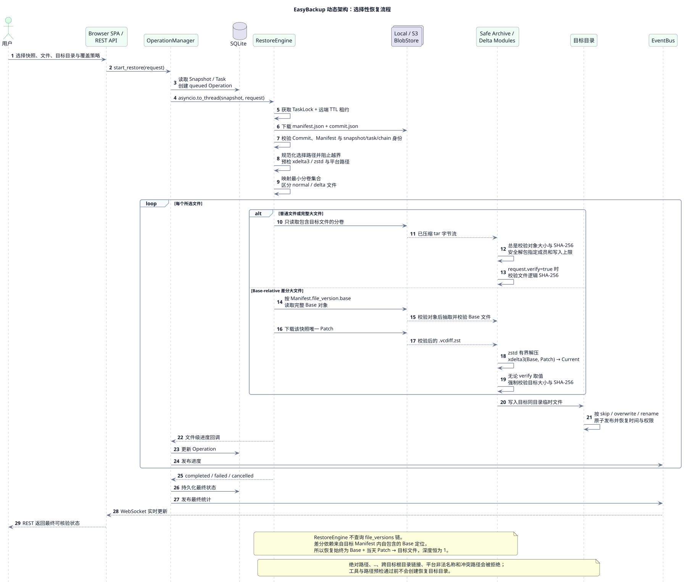

# EasyBackup

> 本地优先、可审计、面向大文件优化的增量备份控制中心。


EasyBackup 通过 Web 控制台管理本地目录到本地仓库、S3 兼容对象存储或 SFTP/SSH 服务器的全量、增量备份。它使用多分卷归档降低选择性恢复成本，并对达到阈值的大文件生成 **Base-relative xdelta3 补丁**：同一备份链内的每个补丁都直接依赖完整 Base，因此差分恢复始终只需要 `Base + 当天 Patch`。

## 目录

- [功能亮点](#功能亮点)
- [快速开始](#快速开始)
- [使用方式](#使用方式)
- [架构](#架构)
- [工作原理](#工作原理)
- [配置](#配置)
- [可靠性与安全](#可靠性与安全)
- [已知限制](#已知限制)
- [开发与测试](#开发与测试)
- [更多文档](#更多文档)

## 功能亮点

- **统一控制中心**：FastAPI REST、Swagger、WebSocket 实时进度、无前端构建步骤的响应式 Web UI。
- **自动化备份**：APScheduler Cron 调度、手动全量、增量链、取消、保留策略与周期巡检。
- **本地与远端存储**：统一 BlobStore 抽象，支持本地目录、AWS S3、MinIO、常见 S3 兼容服务，以及使用密码或 SSH 私钥认证的 SFTP 服务器。
- **高效选择性恢复**：约 256 MiB 多分卷、文件级选择、`skip / overwrite / rename` 覆盖策略与安全路径校验。
- **大文件差分**：`xdelta3 + zstd`、Base-relative 单步恢复、补丁收益评估、生成后反向应用与 SHA-256 验证。
- **可靠性与安全边界**：SQLite WAL、客户端 SHA-256 与块 CRC32、Commit 最后发布、启动对账、本地锁、远端租约、Keyring 优先的凭据存储。

## 快速开始

### 环境要求

- Python 3.10 或更高版本。
- 阿里云 OSS 原生租约支持由项目的核心依赖 `alibabacloud-oss-v2>=1.3,<2` 提供，执行 `pip install -e .` 时会一并安装。
- SFTP 支持由项目的核心依赖 `Paramiko>=4,<6` 提供，执行 `pip install -e .` 时会一并安装。
- 普通备份不依赖外部 `tar`：归档由 Python 标准库生成。
- `zstd` 为推荐压缩工具；`compression=auto` 在缺少它时自动使用 `gzip`。
- 大文件差分需要 `xdelta3` 和 `zstd`。创建差分时缺少工具会安全回退完整分卷；恢复已有差分时必须具备这两个工具。

### Windows + Miniconda

以下命令适用于默认安装在 `%USERPROFILE%\miniconda3` 的 Miniconda：

```powershell
$minicondaPython = Join-Path $env:USERPROFILE "miniconda3\python.exe"
& $minicondaPython -m venv .venv
.\.venv\Scripts\python.exe -m pip install -e .

$env:EASYBACKUP_DATA_DIR = "$PWD\easybackup-data"
.\.venv\Scripts\python.exe -m easybackup doctor
.\.venv\Scripts\python.exe -m easybackup serve
```

也可以使用任意 Python 3.10+：

```powershell
python -m venv .venv
.\.venv\Scripts\python.exe -m pip install -e .
.\.venv\Scripts\python.exe -m easybackup serve
```

启动后访问：

- Web UI：<http://127.0.0.1:8765/>
- Swagger API：<http://127.0.0.1:8765/api/docs>
- 健康检查：<http://127.0.0.1:8765/health>

> `easybackup doctor` 会报告 Python、SQLite、凭据后端、`zstd` 和 `xdelta3` 的实际检测结果。Windows 下还会搜索当前 Python/Conda 的 `Library\bin`、`Scripts` 和根目录。

### 可选：系统托盘

```powershell
.\.venv\Scripts\python.exe -m pip install -e ".[tray]"
.\.venv\Scripts\easybackup-tray.exe
```

## 使用方式

首次启动后，建议按以下顺序完成闭环：

1. S3 或 SFTP 目标先在“凭据”中创建对应协议的 Profile；SFTP 可选择“密码”或“SSH 私钥 + 可选 Passphrase”，本地目标可跳过。
2. SFTP 首次连接时，使用管理员提供的 OpenSSH `SHA256:...` 主机密钥指纹，或准备可信的 `known_hosts` 文件；不要把检测页展示的未受信指纹直接视为可信。
3. 创建任务并设置源目录、存储目标、Cron、排除规则、分卷与差分参数。
4. 使用“测试连接”验证目标可写、可读取、可查询元数据并可删除。阿里云 OSS 还会验证原生 AppendObject position CAS 与可续期租约；SFTP 还会验证排他创建、原子重命名、并发会话与可续期租约。
5. 先运行一次全量备份，再检查快照 Manifest 与文件版本。
6. 对测试目录执行选择性恢复，并运行抽样或深度巡检。

### CLI

| 命令 | 作用 |
| --- | --- |
| `easybackup` | 等价于 `easybackup serve` |
| `easybackup serve` | 启动 Web 控制中心并默认打开浏览器 |
| `easybackup serve --host HOST --port PORT --no-browser` | 覆盖监听地址、端口或禁止自动打开浏览器 |
| `easybackup init` | 创建数据目录并初始化/迁移 SQLite |
| `easybackup doctor` | 输出数据库、凭据后端与外部工具诊断报告 |
| `easybackup tray` / `easybackup-tray` | 启动可选托盘模式 |
| `easybackup --version` | 显示当前版本 |

所有命令也可使用 `python -m easybackup ...` 调用。

## 架构

GitHub 不会原生渲染 `.puml`，因此仓库同时提交 PlantUML 源文件和生成后的 SVG。点击图片可以查看对应源码。

### 静态架构 1：系统上下文与部署边界

[](docs/architecture.puml)

展示操作者、源目录、EasyBackup 主机、本地数据、操作系统 Keyring，以及本地、S3 与 SFTP/SSH 备份仓库之间的信任与部署边界。

### 静态架构 2：应用内部组件

[](docs/component-architecture.puml)

展示安全中间件、FastAPI 控制平面、OperationManager、工作线程中的三个 Engine、启动/周期对账，以及数据库、锁、凭据和 Local/S3/SFTP BlobStore 适配器。

### 静态架构 3：SQLite 数据模型

[](docs/database-schema.puml)

展示 `tasks / snapshots / file_state / file_versions / operations` 的真实外键、逻辑引用和 Base-relative 自关联约束。

### 静态架构 4：本地目录与对象布局

[](docs/storage-layout.puml)

展示运行数据目录、Local/S3/SFTP 共用的逻辑对象键、SFTP 租约 CAS guard、Manifest 对完整分卷/Base/Patch 的引用，以及 Commit 最后发布的可见性边界。

### 动态架构 1：备份流程

[](docs/backup-flow.puml)

备份时先取得本机锁与远端租约，再选择全量或增量分支；分卷和 Patch 成功上传后依次发布 `manifest.json` 与 `commit.json`，最后提交本地事务。

### 动态架构 2：恢复流程

[](docs/restore-flow.puml)

恢复先验证 Commit 与 Manifest，再只下载目标文件涉及的分卷。差分文件通过 Manifest 内自包含的 Base 定位直接执行 `Base + Patch → Current`，不遍历中间 Patch。

## 工作原理

### 快照链与多分卷

每条链由一个全量快照和若干增量快照组成。普通变化文件按 `shard_size_mb` 规划成独立分卷；未变化文件继续引用先前对象，删除项以墓碑记录。选择性恢复只读取包含所选文件的分卷，不必下载整条链的大归档。

默认 `full_every=6` 表示完成 6 次成功增量后，下一次运行建立新的全量链。如果任务每天运行一次，就形成“1 次全量 + 6 次增量”的自然周期，但它不与具体星期绑定。

### Base-relative 大文件差分

达到 `delta_threshold_mb` 的变化大文件会进入差分候选分支：

1. 从 SQLite `file_versions` 中查找当前链内该路径的完整 Base。
2. 固定并校验当前文件，执行 `xdelta3(Base, Current) → Patch`。
3. 使用 `zstd` 压缩 Patch，再反向应用并验证目标大小与 SHA-256。
4. 仅当压缩 Patch 小于 `delta_max_ratio × 原文件大小` 时采用差分；否则回退完整分卷。
5. 在 Manifest 与 SQLite 中记录 Patch、完整 Base 定位和依赖版本 ID。

同一链内的所有 Patch 都直接依赖完整 Base，不形成串行补丁链。某一天的 Patch 损坏不会阻断其他日期的差分快照恢复。

### 两阶段发布与崩溃对账

远端对象按以下顺序发布：

```text
不可变 volumes / patches
          ↓
     manifest.json
          ↓
 commit.json（最后写入）
```

只有带有效 Commit 且 Manifest 摘要匹配的快照才可恢复。若进程在远端 Commit 已发布、本地 SQLite 尚未提交时中断，启动与周期对账会使用远端证据补全状态；未发布 Commit 的残留对象会在取得锁与租约后清理。

### 对象布局

```text
v1/tasks/{task_id}/
├── write.lock.json
├── write.lock.json.cas.guard  # 仅在 SFTP 租约变更期间短暂存在
└── chains/{chain_id}/snapshots/{snapshot_id}/
    ├── volumes/*.tar.zst
    ├── patches/*.vcdiff.zst
    ├── manifest.json
    └── commit.json
```

具体扩展名会随 `zstd / gzip / none` 压缩模式变化。

## 配置

### 环境变量

| 变量 | 默认值 / 说明 |
| --- | --- |
| `EASYBACKUP_DATA_DIR` | Windows：`%LOCALAPPDATA%\EasyBackup`；其他平台：`$XDG_DATA_HOME/easybackup` 或 `~/.easybackup` |
| `EASYBACKUP_HOST` | `127.0.0.1` |
| `EASYBACKUP_PORT` | `8765` |
| `EASYBACKUP_TIMEZONE` | `Asia/Shanghai` |
| `EASYBACKUP_SCRUB_SCHEDULE` | `0 3 * * sun`；空字符串禁用周期巡检 |
| `EASYBACKUP_ALLOWED_HOSTS` | 逗号分隔的额外 Host，默认空 |
| `EASYBACKUP_LOG_LEVEL` | `INFO` |
| `EASYBACKUP_API_TOKEN` | 默认空；非 loopback 监听时必填 |
| `EASYBACKUP_CREDENTIAL_BACKEND` | `auto`；可选 `auto / keyring / encrypted_file` |
| `EASYBACKUP_OPEN_BROWSER` | `true` |
| `EASYBACKUP_SHUTDOWN_TIMEOUT` | `30` 秒 |
| `EASYBACKUP_RECONCILE_INTERVAL` | `60` 秒 |
| `EASYBACKUP_INTEGRITY_BLOCK_SIZE` | `8388608` 字节（8 MiB） |
| `EASYBACKUP_XDELTA3_PATH` | 可选的 `xdelta3` 绝对路径 |

`.env.example` 仅作为配置参考；项目不会自动读取 `.env`。请通过 PowerShell、Shell、容器或服务管理器注入变量。

### 阿里云 OSS 存储目标

阿里云 OSS 在 Web UI 和任务 API 中仍配置为 `S3` 目标。分卷、Patch、Manifest 与 Commit 等数据对象继续通过 OSS 的 S3 兼容 Endpoint 读写；`write.lock.json` 远端租约则由官方 OSS SDK 调用原生 `AppendObject`，使用 `position` 条件实现 CAS，避免 S3 兼容接口不支持条件 `PutObject` 导致租约失败。

```json
{
  "kind": "s3",
  "bucket": "backup-dinnerparty",
  "prefix": "easybackup",
  "region": "cn-shanghai",
  "endpoint_url": "https://s3.oss-cn-shanghai.aliyuncs.com",
  "credential_profile": "aliyun",
  "storage_class": null,
  "multipart_chunk_mb": 16,
  "upload_limit_mbps": 0
}
```

- `region` 为必填项，并且必须与 Bucket 所在地域一致，例如上海填写 `cn-shanghai`。
- 数据 Endpoint 使用对应地域的 S3 兼容地址；若填写 `oss-cn-shanghai.aliyuncs.com`，EasyBackup 会自动补全 HTTPS 并转换为 `https://s3.oss-cn-shanghai.aliyuncs.com`。
- `storage_class` 可留空以继承 Bucket 的存储类别；需要显式指定时使用 S3 兼容值，例如 `STANDARD` 或 `STANDARD_IA`。
- `upload_limit_mbps` 是单个任务的 S3/OSS 上传带宽上限，单位为网络常用的 Mbps（兆比特/秒）；`0` 表示不限速，非零值至少为 `1`。启用限速时 EasyBackup 会强制使用支持带宽控制的 boto3 classic transfer manager，普通上传与 Multipart Upload 使用同一上限。较低的最小值也保证取消操作能在有限时间内被传输器观察到。
- AccessKey 由 S3 类型的凭据 Profile 提供。原生 OSS SDK 已是项目核心依赖，无需另行安装；升级后请重新执行 `pip install -e .`。
- 保存配置后运行“测试连接”。除对象上传、读取、元数据查询与删除外，检测还会实际获取、续期并释放一次原生 OSS 租约；只有可续期租约验证通过，目标才适合用于备份。

### SFTP 存储目标

SFTP 任务只在 SQLite 中保存连接参数与凭据 Profile 名称，用户名、密码、私钥和私钥 Passphrase 均由 CredentialStore 管理。以下 JSON 与任务 API 中的 `storage` 字段一致；Web UI 会生成同样的配置：

```json
{
  "kind": "sftp",
  "host": "backup.example.com",
  "port": 22,
  "base_path": "easybackup",
  "credential_profile": "sftp-production",
  "host_key_fingerprint": "SHA256:REPLACE_WITH_VERIFIED_SERVER_FINGERPRINT",
  "known_hosts_path": null,
  "connect_timeout_seconds": 15
}
```

- `base_path` 默认为登录目录下的 `easybackup`；也可以填写服务器允许访问的绝对 POSIX 路径。
- `host_key_fingerprint` 与 `known_hosts_path` 二选一。两者都留空时使用运行 EasyBackup 的账号所能读取的系统 `known_hosts`，未知主机密钥会被拒绝。
- 指纹必须通过服务器管理员、控制台或其他可信通道核对。检测失败时展示的 observed fingerprint 只是辅助核对信息，不构成自动信任。
- 凭据 Profile 必须是 SFTP 类型，并包含用户名及密码，或用户名、完整 SSH 私钥与可选 Passphrase。EasyBackup 不会自动搜索 `~/.ssh` 私钥，也不会使用 SSH Agent，以保证计划任务的认证来源确定。

#### SFTP 服务器能力要求

EasyBackup 不只测试“能否登录”。正式使用前，服务器还必须满足：

| 能力 | 用途 |
| --- | --- |
| SFTP `OPEN_EXCL` 排他创建 | 串行化租约 CAS guard，阻止多个写入者同时取得所有权 |
| `posix-rename@openssh.com` 原子覆盖 | 将同目录 `.part` 文件原子发布为最终对象，避免暴露半写入备份 |
| 至少两个并发 SSH/SFTP 会话 | 大文件传输期间让独立租约心跳继续续期 |
| 创建、读取、列举、重命名和删除权限 | 支持备份、恢复、巡检、保留策略与失败清理 |

配置页的“测试连接”会实际验证这些语义；缺少任一安全能力时会拒绝通过，不能通过关闭检查绕过。OpenSSH SFTP 通常提供所需扩展，其他服务器应以实际探针结果为准。

### 任务默认值

| 参数 | 默认值 | 含义 |
| --- | ---: | --- |
| `compression` | `auto` | 优先 zstd，缺失时使用 gzip |
| `compression_level` | `3` | zstd 压缩级别 |
| `shard_size_mb` | `256` | 普通分卷目标大小 |
| `full_every` | `6` | 成功增量次数达到该值后重建全量链 |
| `delta_enabled` | `true` | 启用大文件差分候选分支 |
| `delta_threshold_mb` | `100` | 大文件差分阈值 |
| `delta_max_ratio` | `0.9` | Patch 相对原文件的最大采用比例 |
| `retention_chains` | `3` | 保留链数量 |
| `retention_days` | `30` | 保留天数 |
| `follow_symlinks` | `false` | 默认不跟随符号链接 |

## 可靠性与安全

- **完整性**：客户端计算压缩对象 SHA-256，并以块 CRC32 支持抽样巡检；不把 S3 ETag 当作完整性证明。
- **恢复安全**：校验 Commit、Manifest、对象和最终文件；拒绝绝对路径、`..`、越界链接与平台非法路径，使用同目录临时文件原子发布。
- **并发控制**：每任务本地文件锁配合远端带 TTL 的租约，降低重复执行和多实例写入冲突。阿里云 OSS 通过原生 `AppendObject` position CAS 更新租约；SFTP 通过 `OPEN_EXCL` guard 串行化租约更新，并通过 POSIX rename 原子发布对象。
- **凭据保护**：`auto` 优先操作系统 Keyring，失败时回退机器绑定 AES-256-GCM 文件；S3 密钥以及 SFTP 密码、私钥和 Passphrase 均不写入任务表、快照或日志。
- **SSH 主机身份**：SFTP 使用经过核对的 SHA-256 指纹、指定 `known_hosts` 或系统 `known_hosts`；未知或不匹配的主机密钥会 fail-closed，不使用 TOFU 自动接受。
- **网络边界**：默认仅监听 loopback。绑定非本机地址必须设置 API Token，并应配置可信 TLS 反向代理、来源限制和正式身份认证。
- **可运维性**：SQLite WAL、结构化操作状态、WebSocket 进度、取消、抽样/深度巡检、完整链保留与启动对账。
- **控制平面响应性**：扫描与传输在工作线程运行；高频进度采用 latest-wins 合并并限制为每秒最多 4 次，避免大文件哈希期间阻塞 HTTP、WebSocket 与退出信号。服务关闭时会先向活动操作发送取消请求，再等待其安全释放本地锁和远端租约。

## 已知限制

- EasyBackup 不是 VSS、LVM、ZFS 或应用原生快照；持续写入的数据库和业务文件不保证应用一致性。
- 一个远端任务前缀应由一个权威 SQLite/写入主机管理；远端租约不是严格的 fencing-token 协议。
- SFTP 客户端若在租约更新的极短临界区崩溃，可能遗留 `write.lock.json.cas.guard`。EasyBackup 会 fail-closed，绝不会按 mtime 自动删除它；管理员必须先确认所有 EasyBackup 实例均已停止，再手动删除诊断中给出的精确 guard 路径并重新运行“测试连接”。
- 不支持 SFTP `OPEN_EXCL`、`posix-rename@openssh.com` 或至少两个并发会话的服务器，不能作为安全的 SFTP 存储目标。
- 已有差分版本的恢复必须具备 `xdelta3` 和 `zstd`，且差分生成/恢复需要临时磁盘空间。
- 备份负载当前是压缩而非客户端侧加密；敏感数据应使用私有 Bucket、TLS、SSE-S3/SSE-KMS 或额外加密层。
- 机器绑定凭据降级方案不能抵御本机管理员或同等级攻击者，生产环境应优先使用操作系统 Keyring。
- 内置 Web 服务不应直接暴露到公网；API Token 不能替代 TLS 和成熟的身份认证系统。

## 开发与测试

```powershell
.\.venv\Scripts\python.exe -m pip install -e ".[dev]"
.\.venv\Scripts\python.exe -m pytest
```

项目没有前端构建步骤；静态 UI 位于 `src/easybackup/static/`。主要目录：

```text
easyBackup/
├── src/easybackup/
│   ├── app.py              # FastAPI、REST、WebSocket 与生命周期
│   ├── engine/             # 备份、恢复、巡检与保留
│   ├── storage/            # 本地、S3 与 SFTP BlobStore
│   ├── static/             # Web UI
│   ├── db.py               # SQLite Schema 与仓储
│   ├── scanner.py          # 文件扫描与变化识别
│   ├── delta*.py           # xdelta3 差分工作流
│   └── security.py         # 凭据后端
├── tests/
├── docs/
├── .env.example
└── pyproject.toml
```

提交改动前请至少运行完整测试套件，并为备份格式、恢复安全或数据库 Schema 变更补充端到端测试。

## 更多文档

- [运维与故障排查](docs/operations.md)
- [系统上下文 PUML](docs/architecture.puml)
- [应用组件 PUML](docs/component-architecture.puml)
- [SQLite Schema PUML](docs/database-schema.puml)
- [存储布局 PUML](docs/storage-layout.puml)
- [备份流程 PUML](docs/backup-flow.puml)
- [恢复流程 PUML](docs/restore-flow.puml)
- 运行服务后的交互式 API 文档：<http://127.0.0.1:8765/api/docs>

> 当前仓库尚未包含开源许可证。在公开分发或接受外部贡献前，请先添加合适的 `LICENSE` 文件。
